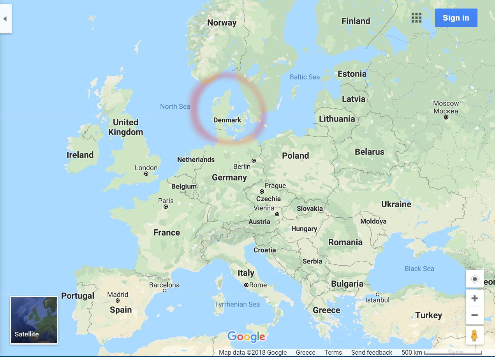

# Weather-data for Denmark 1980-2018

[Original repository on GitHub](https://github.com/Hvass-Labs/weather-denmark)

## Data Overview

* This data-set is intended for use in research on Machine Learning and Time-Series Prediction.
* The weather-data covers the period between 1980-2018 for five Danish cities: Aalborg, Aarhus, Esbjerg, Odense and Roskilde.
* Each data-point measures the temperature (Celcius), the barometric pressure (hecto-pascal or milli-bar), the wind-speed (meters per second), and the wind-direction (angular degrees).
* Some data is partially missing, e.g. periods of the barometric pressure in some cities.
* Some errors have been discovered in the data, e.g. a few temperature-measurements are clearly wrong.

## Source

The raw weather-data was originally obtained from the [National Climatic Data Center (NCDC) in USA](https://www7.ncdc.noaa.gov/CDO/cdoselect.cmd).

The raw data-file had some formatting problems that had to be corrected manually. This archive contains a cleaned-up version of the data-file, that is easier to load either as a CSV-file or as a so-called pickle-file for use in Pandas with Python.

## Installation

The archived tar-ball is automatically downloaded and extracted by using the [weather.py](https://github.com/Hvass-Labs/TensorFlow-Tutorials/blob/master/weather.py) module for Python.

## Location

 

## License

According to the instructions on NCDC's web-site, this data can only be used and redistributed for non-commercial purposes.

